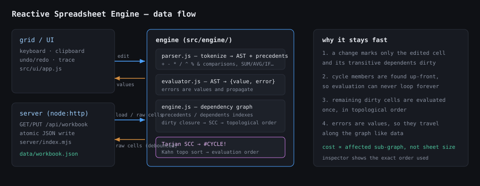

# Reactive Spreadsheet Engine

A compact, Excel-like spreadsheet with a **hand-written formula parser**, a **real dependency
graph**, and **incremental reactive recalculation** — plus a small persistence backend so a
reload never loses formulas or computed results.

No spreadsheet/formula library is used anywhere: tokenizer, parser, evaluator, dependency
graph, cycle detection and the recalculation scheduler are all in `src/engine/`.



---

## Quick start

Requires **Node.js 18+** (developed on Node 24). The server itself has **zero runtime
dependencies**; `esbuild` and `jsdom` are only used for the production build and the test suite.

```bash
npm install          # dev dependencies (esbuild, jsdom) — optional for `npm run dev`
npm run dev          # development:  http://127.0.0.1:5173  (serves public/ + src/ as ESM)
```

Production:

```bash
npm run build        # bundles src/ -> dist/ (minified + sourcemap)
npm start            # serves dist/  ->  http://127.0.0.1:5173
# or both in one step:
npm run prod
```

Tests (engine, UI, backend, and a full production-bundle end-to-end test):

```bash
npm test
npm run check        # tests + production build
```

Environment overrides: `PORT` (default `5173`), `DATA_FILE` (default `data/workbook.json`).

---

## Acceptance scenario — how to run it by hand

**1. A dependency chain at least three levels deep, then change the root**

Click *Demo chain* in the toolbar (or type the cells yourself):

| Cell | Raw | Value |
|------|-----|-------|
| `A1` | `10` | `10` |
| `A2` | `=A1*2` | `20` |
| `A3` | `=A2+5` | `25` |
| `A4` | `=SUM(A1:A3)` | `55` |
| `B1` | `=AVG(A1:A4)` | `27.5` |

`A4` depends on `A3`, which depends on `A2`, which depends on `A1` — four levels.
Select `A4`: `A1..A3` light up **blue** (its inputs, thick border = direct), and nothing orange.
Select `A1`: `A2`, `A3`, `A4`, `B1` light up **orange** (its consumers, direct = thick).

Now double-click `A1`, type `100`, press Enter. The cascade runs in dependency order and the
values become `200`, `205`, `505`, `227.5`. The inspector’s **Last recalculation order** lists
exactly the cells that were recomputed — `A1, A2, A3, A4, B1` — and the status bar reports
`5 recalculated last pass`. Untouched cells are never revisited.

**2. An indirect circular reference**

Click *Inject cycle*, or type `E1 = =E2+1` and `E2 = =E1+1`. Both cells — and every cell that
reads them (`E3 = =E1*2`) — immediately display **`#CYCLE!`**, with a purple background and a
warning in the inspector. The app never hangs: cycles are detected with Tarjan’s SCC algorithm
before evaluation, not by recursion depth. Break the cycle by setting `E2` to a plain number and
the values return instantly.

**3. Errors**

Click *Inject errors*, or type:

| Formula | Result | Why |
|---------|--------|-----|
| `=A1/0` | `#DIV/0!` | division by zero |
| `=A0` | `#REF!` | row 0 cannot exist (`=AAAA1`, `=#REF!+1` too) |
| `="t"*2` | `#VALUE!` | text in an arithmetic expression |
| `=NOSUCH(1)` | `#NAME?` | unknown function |
| `=1+` | `#PARSE!` | malformed formula |

Errors are values, not exceptions: `=B1+1` where `B1` is `#DIV/0!` is itself `#DIV/0!`, so errors
propagate along the graph and disappear the moment their cause is fixed.

**4. Undo, redo, persistence**

`Ctrl+Z` / `Ctrl+Shift+Z` (or `Ctrl+Y`) undo/redo the last **100** edits, including multi-cell
paste and block-delete as single steps. Every edit is PUT to the backend after a 400 ms debounce
(watch the *saved* timestamp in the toolbar). Reload the page: raw values, formulas and computed
results come back exactly as they were — verified by an automated test that loads the built
bundle twice against the live server (`tests/bundle.test.mjs`).

---

## Using the grid

| Action | Keys |
|--------|------|
| Move / extend selection | Arrows, `Shift`+Arrows, `PageUp`/`PageDown`, `Home`/`End` |
| Edit cell | `Enter`, `F2`, double-click, or just start typing (replaces content) |
| Commit / cancel | `Enter` or `Tab` (moves down / right, `Shift` reverses) · `Escape` cancels |
| Clear selection | `Delete` / `Backspace` |
| Copy / cut / paste | `Ctrl+C`, `Ctrl+X`, `Ctrl+V` (TSV — pastes cleanly to and from Excel/Sheets) |
| Select all | `Ctrl+A` |
| Undo / redo | `Ctrl+Z` / `Ctrl+Shift+Z` / `Ctrl+Y` |
| Formula bar | Edit the raw text of the active cell; Enter commits |

Colors: **blue** = cells this formula reads, **orange** = cells that read this formula,
thicker border = direct dependency, faded = transitive. Toggle with *Trace deps*.
Purple = participating in a cycle, red text = error.

---

## Formula language

* **References** — `A1`, `$B$2` (absolute markers are accepted and ignored), forward references
  to cells defined later, and ranges `A1:B10`.
* **Operators** — `+ - * / ^`, unary `+ -`, postfix `%`, string concat `&`,
  comparisons `= <> < <= > >=`, parentheses. Precedence:
  comparison < `&` < `+ -` < `* /` < unary minus < `^` (right-associative) < `%`.
* **Functions** — `SUM`, `AVG`/`AVERAGE`, `MIN`, `MAX`, `COUNT`, `COUNTA`, `IF`, `AND`, `OR`,
  `NOT`, `ABS`, `ROUND`, `SQRT`, `POWER`. Arguments may mix ranges, references and arithmetic:
  `=SUM(A1:A5)/AVG(B1:B5)+ROUND(C1*2,2)`.
* **Values** — numbers, text, `TRUE`/`FALSE`. Blank cells count as `0` in arithmetic and are
  skipped by aggregates; non-numeric text inside a range is ignored by `SUM`/`AVG` (Excel
  behaviour) but poisons arithmetic (`=A1+1` where `A1` is text → `#VALUE!`).
* **Errors** — `#DIV/0!`, `#REF!`, `#VALUE!`, `#CYCLE!`, `#NAME?`, `#PARSE!`, `#NUM!`.
  A `#REF!` is produced for addresses that cannot exist (`A0`, `AAAA1`) or an explicit `#REF!`
  literal. References outside the visible 26 × 60 grid are legal and read as blank.

---

## Architecture

```
public/index.html ─┐
public/styles.css  ├── dev: served as-is, ES modules straight from src/
src/main.js ───────┘
      │
      ├── src/engine/errors.js     error values + helpers
      ├── src/engine/refs.js       A1 <-> (col,row), range expansion
      ├── src/engine/parser.js     tokenizer + precedence-climbing parser -> AST + precedents
      ├── src/engine/evaluator.js  AST -> {value, error}; functions; error propagation
      ├── src/engine/engine.js     dependency graph + scheduler  ← the reactive core
      └── src/ui/app.js            grid, selection, editing, clipboard, undo, inspector
              │
              └── fetch /api/workbook ──> server/index.mjs ──> data/workbook.json (atomic write)
```

**Scheduling.** Every cell stores its raw text, its parsed AST and the set of cells its formula
reads; `dependents` is the reverse index. On an edit the engine computes the dirty closure
(the edited cell plus every transitive dependent), then:

1. **Tarjan’s SCC** over the dirty sub-graph marks cycle members → `#CYCLE!`
   (self-references included). No recursion on cell values, so it cannot hang.
2. **Kahn’s topological sort** orders the remaining dirty cells so every formula is evaluated
   after all of its inputs — this is what makes multi-level chains and forward references work.
3. Cells are evaluated in that order and error values propagate as ordinary values.

Cost is proportional to the affected sub-graph, not to the size of the sheet: editing a root cell
in a 100 000-cell workbook only touches what depends on it. `engine.lastRecalc` exposes the
ordered list of cells recomputed by the last edit, which is what the inspector displays.

**Backend.** `server/index.mjs` is dependency-free `node:http`: it serves the app, persists the
workbook to `data/workbook.json` through an atomic temp-file + rename, serializes concurrent
writes, validates every incoming address (`A1`-style only, size-capped) and restores a seeded
default workbook on first boot or on `POST /api/workbook/reset`.

| Endpoint | Method | Description |
|----------|--------|-------------|
| `/api/health` | GET | `{ ok: true }` |
| `/api/workbook` | GET | `{ cells, updatedAt, meta, source }` |
| `/api/workbook` | PUT | body `{ cells }`; validates, persists, returns the stored document |
| `/api/workbook/reset` | POST | restores the default workbook |
| `/`, `/src/*`, `/assets/*`, `/styles.css` | GET | static app shell (dev: sources, prod: bundle) |

---

## Tests

`npm test` runs 40 tests across four suites (`node --test`):

* `tests/engine.test.mjs` — literals, precedence, references, forward references, `SUM`/`AVG`,
  range semantics, incremental recalculation (only affected cells, valid topological order),
  deep chains, direct/indirect/self cycles, all error codes and propagation, graph queries,
  serialize/load round-trip, parser rejections.
* `tests/ui.test.mjs` — jsdom-driven interface: grid dimensions, typing/Enter/Escape editing,
  formula bar, arrow navigation and shift-selection, >20 undo/redo steps, copy & paste (TSV),
  block delete, precedent/dependent highlighting, cycle and error rendering, UI cascade,
  inspector contents, and load-on-mount + debounced save.
* `tests/server.test.mjs` — address sanitisation, API round-trip, persistence across a server
  restart, static shell and ES module serving, path-traversal refusal, error handling.
* `tests/bundle.test.mjs` — runs the real production build, boots the real production server on
  a temp workbook, executes the built bundle in jsdom, then verifies the 4-level cascade,
  the persisted edit, a fresh page load reproducing the same values, undo/redo, `#CYCLE!` and
  the error codes, and that the built assets are served with the right content types.

## Layout

```
src/engine/     formula engine (parser, evaluator, graph, scheduler)   — no DOM, no deps
src/ui/app.js   the grid widget (mountable, jsdom-testable)
src/main.js     browser entry point (REST client + mount)
public/         dev shell + stylesheet
server/         node:http API + static server + JSON store
scripts/        esbuild production build
tests/          engine / ui / server / bundle suites
data/           workbook.json (created on first save; git-ignored)
```
